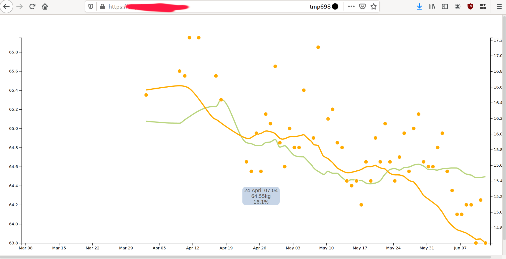

# Clap Hands

> If you're API and you know weight, clap your hands.

If you have a Withings wireless scale and you're not impressed with
the Healthmate web ui, you might find this a bit prettier/more usable.



## Features

* Displays weight measures and trend line based on exponetial moving average

* Displays fat percentage (unsmoothed, WIP)

* Zoom and pan using standard gestures (drag, scroll wheel zoom,
  pinch-to-zoom on mobile, etc)

## Installation

It's not in any kind of a "finished" state, but it works well enough
for me to dogfood. 

Needs Python with some packages (last I checked, these were pip pylint
setuptools pyyaml flask - but see `shell.nix` for the up-to-date list)

Register a Withings developer application by visiting
https://developer.withings.com/oauth2/#tag/getting-started.  Note down
the Client Id and Consumer Secret they provide you with, and create a
`secrets.json` file in the same directory as `clap.py`

```
{
    "client_id": "58cd5442c76439c754e8172e452d184a7c69a2ef2c5d8e71c3db3815f7f4245e",
    "consumer_secret": "ebbe0a47dd30efdb7aa8e6692b65b0610318523a649b8b28465502d8aa5a"
    "callback": "https://clap-hands.example.com/callback",
}
```

Start the server running with 

```
FLASK_APP=clap.py FLASK_ENV=development FLASK_PORT=5007 python -m flask run --host=0.0.0.0  --port=5007
```

Create a proxy pointing at it so that you can access it with HTTPS: I
did this with Nginx, but ngrok or something else would work just as
well.  If you don't/won't/can't use HTTPS you need to edit the call to
`response.set_cookie` to remove `secure=True`

## Development

This is my first time writing Python *and* my first time using d3.js,
so the code style may be weird, nonidiomatic, inconsistent, or just
flat-out wrong in places.  Constructive criticism gratefully
received.
